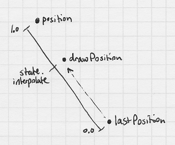
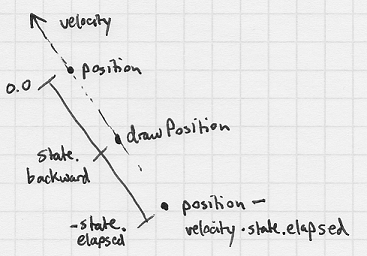
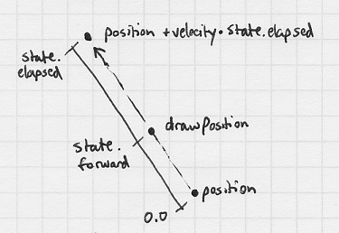

Generic Game Loop
============

1. Summary
2. Objectives
3. Article
  1. What is the game loop?
  2. Variable and Fixed time step
  3. Defining Game, GameState, and GameInput
  4. GameLoop interface
  5. GameLoopVariable implementation
  6. GameLoopInterpolated implementation
  7. GameLoopFixed implementation
  8. Smooth drawing technique
4. Expanding
5. Code Download
6. Applet
7. Next Article

## Summary
Welcome to my first article! This article will discuss game loop theory and implementation. This should be valuable if you’re new to game programming, useful if you’re working on a game engine, and might be interesting even if you’re a seasoned programmer! I’ll touch on the common implementations, add functionality to them, and introduce new concepts! (I think?)

## Objectives
* To design a simple game engine with flexible game loop configuration.
* To have working code with various game loop implementations.
* To implement smooth drawing for fixed time-step game loops.


## Article
#### What is the game loop?
Simple! The game loop is the difference between programming a picture and a game. A game loop does three basic things: notify the game that there’s user input to handle, the game should update the state of it’s objects, and the game should draw those objects to the screen. Here’s an example:

```java
while (playing) {
  handleInput( inputEvents );
  handleUpdate( elapsedTime );
  handleDraw( graphics );
}
```

#### Variable and Fixed time step
This example is a simple and commonly used game loop implementation; It’s referred to as a variable time step game loop. What this means is, it progresses it’s game state through the update call based on the number of seconds that has elapsed since the last update call was made. To move an object’s position with this method would be as simple as:

```java
position = position + velocity * elapsedTime;
```

This is often sufficient for many games, but it has several drawbacks:

* There’s no guarantee how many times the update method will be called. If there’s a spot in the game that is very graphic or update intensive there will be a large delay between updates. These large delays can cause objects to move to quickly, potentially passing through objects they’re not supposed to.
* This method will run as quickly as possible, consuming as much of the processor as it possibly can.

So what alternative is there? Meet fixed time step. Fixed time step will ensure the update method is called X times per second, every second. This leads to more predictable behavior, and can simplify the update logic (no need for elapsedTime if it’s always the same!). A simple fixed time step game loop looks something like this:

```java
while (playing) {
  time += elapsedTime;
  while ( time >= updateInterval ) {
    handleInput( inputEvents );
    handleUpdate( updateInterval );
    time -= updateInterval;
  }
  handleDraw( graphics, distanceBetweenPreviousUpdateFrameAndCurrent );
}
```

That code will ensure handleUpdate is called X times per second, however there is a risk:

* If the time it takes in handleUpdate is consistently greater than updateInterval, the handleDraw method will rarely be called since it’s busy updating. There’s a way to regulate this, and we’ll cover it later.

You can expand on this implementation a bit further and add a drawInterval if you wanted. This would be useful if you wanted to let the Game thread sleep a few milliseconds to let the processor have a little break.

Now, onto the code! Firstly, let’s define what a game is:

```java
interface Game {
  void start();
  void input( GameInput input );
  void update( GameState state );
  void draw( GameState state, Graphics2D gr );
  void destroy();
  boolean isPlaying();
}
```

Based off of this, all you would need to do is implement this interface, and you’re ready to make a game! But you may be thinking, where did GameInput and GameState come from?

#### Defining Game, GameState, and GameInput
*GameInput* is a simple class I made that listens to input events from an AWT component. I broke this out into it’s own class for a very important reason! AWT has a separate thread which handles input… this means you could press a key and it would notify your game, potentially changing a value in the middle of an update. If you’re thinking that’s unlikely, you’re very wrong! This class adds the events that occur to a thread-safe queue to be processed in the input method. Once the input method is finished, these events will be cleared to prepare for the next update call. Here’s what the GameInput class offers:

```java
class GameInput {
  boolean[] keyDown, keyUp, mouseDown, mouseUp;
  boolean mouseInside, mouseDragging, mouseMoving;
  Queue<GameKeyEvent> keyEvents;
  Queue<GameMouseEvent> mouseEvents;
}
```

The *GameState* class. GameState stores information produced by the game loop such as elapsed time since last update, and a couple variables used for drawing:

```java
class GameState {
  float seconds, forward, backward, interpolate;
  long millis, nanos, micros, startTime, lastTime, currentTime;
}
```

#### GameLoop interface
Now, to the meat! Here’s the GameLoop interface, and an explanation to follow:

```java
interface GameLoop {
  void onStart( Game game, GameState state );
  boolean onLoop( Game game, GameState state, GameInput input, Graphics2D gr );
}
```

Pretty straightforward. The onStart method is called before the game starts, this will initialize any variables in the GameLoop implementation. The onLoop method is called in the main loop of the game, and it handles calling the input, update, and draw method on the game passed in. This method returns whether the draw method of the game was called, to let the game thread know to update the screen.

So now our game loop has turned into this:

```java
game.start();
loop.onStart( game, state );
while ( game.isPlaying() )  {
  if ( loop.onLoop( game, state, input, graphics ) ) {
  // display graphics to screen
  }
}
game.destroy();
```

Simple right? Let’s trying implementing the simplest game loop, variable time step.

#### GameLoopVariable implementation
Introducing the implementation of *GameLoopVariable*:

```java
boolean onLoop( Game game, GameState state, GameInput input, Graphics2D gr ) {
  state.setElapsed( state.tick() ); // elapsed time is time since last update 
  game.input( input ); // Game needs to handle input from user
  input.clear(); // Clear input state 
  if ( !game.isPlaying()) {
    return false; // Game stopped in input call, don’t draw to the screen, exit.
  }
  state.update(); // Used for tracking update statistics
  game.update( state ); // Update game state
  if ( !game.isPlaying()) {
    return false; // Game stopped in update call, don’t draw to the screen, exit.
  }
  state.draw(); // Used for tracking draw statistics
  game.draw( state, gr ); // Draw game to the given graphics object
  return true; // Game thread needs to render the graphics drawn
}
```

Of course there’s something going on here you don’t see, what’s the GameState doing when we call setElapsed and tick() ?

```java
// returns nanoseconds since last tick() call
long tick() {
  lastTime = currentTime;
  currentTime = System.nanoTime();
  return (currentTime - lastTime);
}

// sets the elapsed times on the state for all units
void setElapsed( long nanosElapsed ) {
  nanos = nanosElapsed;
  micros = nanosElapsed / 1000L;
  millis = nanosElapsed / 1000000L;
  seconds = (float)(nanosElapsed * 0.000000001);
}
```

Ahh, it looks like we’re done here! Well, I use this game loop type frequently and I occasionally have a problem… sometimes If I do something that takes up a lot of time but only for a single frame, the next elapsed time is huge. This causes problems for sure, but there’s a simple solution:

```java
state.setElapsed( Math.min( maximumElapsed, state.tick() ) );
```

When I create the GameLoopVariable class, I pass in a maximumElapsed time. This will ensure that even if 3 seconds have elapsed sincee the last tick(), the elapsed time on the GameState will at most be maximumElapsed (for example 0.1 second). The only side effect of doing this, is when the actual elapsed time is greater than the maximumElapsed time, that frame will have objects move slower than they should for a frame.

Now on to the more complicated game loops: fixed time step. There are two I want to cover: GameLoopFixed and GameLoopInterpolated. These game loops could be implemented simply, but to do it right can be tricky!

#### GameLoopInterpolated implementation
*GameLoopInterpolated* is a game loop implementation that ensures input and update are called so many times a second. It also ensures draw is called each loop. This means there will be cases where zero to many updates will be called before draw. The variables important to this implementation:

```java
long frameRate; // the number of nanoseconds between update calls
int maxUpdates; // the maximum number of updates to call in a single loop invokation
boolean yield; // whether we should yield the thread to let other threads process freely
long time; // the amount of time since the last update call, in nanoseconds
```

With these variables, we can implement GameLoopInterpolated

```java
boolean onLoop( Game game, GameState state, GameInput input, Graphics2D gr ) { 
  long nanosElapsed = state.tick();
  time += nanosElapsed;
  int updateCount = 0;
  while (time >= frameRate && updateCount < maxUpdates) {
    game.input( input );
    input.clear();
    if (!game.isPlaying()) {
      return false;
    }
    state.update();
    game.update( state );
    if (!game.isPlaying()) {
      return false;
    }
    updateCount++;
    time -= frameRate;
  }
  state.interpolate = getStateInterpolation();
  state.forward = state.interpolate * state.seconds;
  state.backward = state.forward - state.seconds;
  state.draw();
  game.draw( state, gr );
  if (yield) {
    long actualTime = time + state.getElapsedSinceTick();
    long remainingTime = frameRate - actualTime;
    if (remainingTime > 0) {
      Thread.yield();
    }
  }
  return true;
}

float getStateInterpolation() {
  return (float)((double)time / (double)frameRate);
}
```

Oh boy that’s a lot of code all at once, let’s break it up:

```java
long nanosElapsed = state.tick();
time += nanosElapsed;
```

Simple enough, just tracking how much time has passed by

```java
while (time >= frameRate && updateCount < maxUpdates)
```

Ah okay, if the time is greater than the interval and we haven’t called update too many times in this loop, call input and update.

```java
if (!game.isPlaying()) {
  return false;
}
````

Checking if the game is no longer playing after input or update will help us avoid unnecessary rendering, and will ensure the game is quickly stopped.

```java
time -= frameRate;
```

Decreasing time by the frameRate ensures accurrate timing. A nieve implementation would merely set it to zero.

```java
state.interpolate = getStateInterpolation();
state.forward = state.interpolate * state.seconds;
state.backward = state.forward - state.seconds;
```

What’s this? This has to do with smooth drawing, and will be covered in more detail later!

```java
state.draw();
game.draw( state, gr );
...
```

And finally we draw (and yield potentially). Not too bad.

#### GameLoopFixed implementation
So what about the second implementation GameLoopFixed? Well *GameLoopFixed* goes one further and lets you set a draw interval as well! GameLoopFixed will also attempt to sleep the game thread if you want it to, to save processing time. Here are the variables for GameLoopFixed:

```java
long updateRate;
long drawRate;
int maxUpdates;
boolean sleep;
long updateTime;
long drawTime;
```

And the onLoop implementation:

```java
boolean onLoop( Game game, GameState state, GameInput input, Graphics2D gr ) {
  long nanosElapsed = state.tick();
  updateTime += nanosElapsed;
  int updateCount = 0;
  while (updateTime >= updateRate && updateCount < maxUpdates) {
    game.input( input );
    input.clear();
    if (!game.isPlaying()) {
      return false;
    }
    state.update();
    game.update( state );
    if (!game.isPlaying()) {
      return false;
    }
    updateCount++;
    updateTime -= updateRate;
  }
  drawTime += nanosElapsed;
  int drawCount = 0;
  if (drawTime >= drawRate || updateCount > 0) {
    state.interpolate = getStateInterpolation();
    state.forward = state.interpolate * state.seconds;
    state.backward = state.forward - state.seconds;
    state.draw();
    game.draw( state, gr );
    drawCount++;
    drawTime -= (drawRate == 0 ? drawTime : drawRate);
  }
  if (sleep && drawCount == 0 && updateCount == 0) {
    long actualTime = updateTime + state.getElapsedSinceTick();
    long sleep = (updateRate - actualTime) / 1000000L;
    if (sleep > 1) {
      try {
        Thread.sleep( sleep - 1 );
      } catch (Exception e) { }
    }
  }
  return (drawCount > 0);
}
```

I’ll let you figure out how that works, it’s very similar to GameLoopIntepolated.

#### Smooth drawing technique
Onto the final topic, *smooth drawing*! This is a technique you only need to do for fixed time step game loops, since you are drawing more than you are updating (in most cases). Without smooth drawing your objects will skip across the screen, it’s an ugly sight (unless you have high update’s per second, you MIGHT not be able to notice it).

The typical smooth drawing algorithm is called interpolation. Your drawing calculations look like this:

```java
drawPosition = (position - lastPosition) * state.interpolate + lastPosition;
```



*Positives*
- Your object will never appear to collide with another object.

*Negatives*
- This requires you to save the lastPosition for the object.
- This will draw the object “behind” where it was in the last update. In the worst case, the object’s position on the screen could be “updateInterval” behind.

The next drawing algorithm I call backward extrapolation. The drawing calculations look like this:

```java
drawPosition = position + state.backward * velocity;
```



*Positives*
- You don’t need to save lastPosition.

*Negatives*
- This will draw the object “behind” where it was in the last update. In the worst case, the object’s position on the screen could be “updateInterval” behind.
- The object will be “back in time” where the object was based on its velocity… but since the velocity can change when a collision occurs, the object could be visually placed in the collided object when it’s moving away from it.

The final drawing algorithmm I call forward extrapolation. The drawing calculations look like this:

```java
drawPosition = position + state.forward * velocity;
```



*Positives*
- You don’t need to save lastPosition.
- Visually, the objects will be most up-to-date with the current state of the game.

*Negatives*
- This will draw the object “ahead” where it’s supposed to be. In worst case the object’s position on the screen could be “updateInterval” ahead.
- The object will be “forward in time” where the object could be (if it doesn’t collide with anything). If it collides with anything in the next update call, it may appear to penetrate the object.

Overall I don’t have a preference between these three algorithms, which one you use is dependent on the game type. Once you define your update rate and draw rate goals, picking the smooth drawing algorithm that looks the nicest for your game is the next step!

*Notes*
- If you set the position of an entity to some value (opposed to incrementing by velocity), you need to set lastPosition to that value as well. If you don’t you could have entities teleporting across the screen.
- These interpolation methods are linear (also known as lerp), for angles you need to use spherical interpolation (also known as slerp)
- These interpolation methods will not work for complex structures like matrices and quaternions, other equations are used to interpolate these structures.

I hope this helps you! The example code is available to download, and there is an applet you can expirement with. The applet lets you change your game loop implementation while the game is running, and you can toggle through the different smooth drawing methods to see how they perform.

If you have any questions, please ask away!

## Expanding

The update and drawing code presented here uses what’s called Euler integration.  Other integration methods like Verlet and Runge-Kutta (RK4) could be used and subsequently you could develop a better smooth drawing algorithm for those integration methods (one that doesn’t result in penetration and is visually more accurrate to the current state of the game).

## Code Download

The code was written in Java and uses Java2D for drawing. Java2D was chosen because it is part of the Java SDK and it doesn’t require any external libraries. This code is easily translatable to other languages and other graphics libraries.

[Source Code](download/GameProgBlog-Article-Loop.zip)

## Applet

[Applet](download/loop.jar)

## Next Article

In the next article I’m going to talk about managing game entities. Managing (updating & drawing) lists and layers of game entities is non-trivial to the beginner, and could be improved upon even for the experienced. This article will go over a quick method that has no overhead when adding and removing entities to and from your game.
